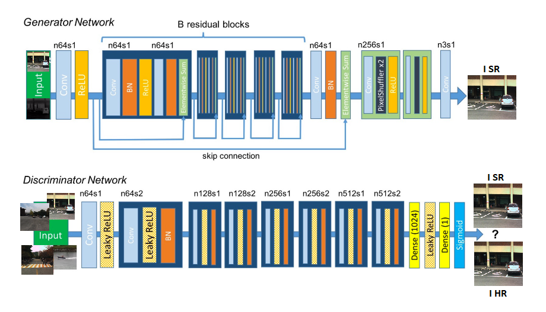

# Pixelx4
Pixel x4 is a image super-resolution deep learning algorithm. It uses both the deep convolutional GANs for generating realistic images and the distance based loss function for creating visually similar images.

The previous work proposes a super-resolution generative adversarial network (SRGAN [1]) which employs a deep residual network (ResNet) with skip-connection. In our proposed architecture, the neural network takes a low-resolution image (RGB and its Thermal Counterpart) and predicts the high-resolution image. The idea behind using thermal image is for better feature extraction which can be then used to reconstruct the image better. Thermal images are unaffected by luminous sources and hence will provide good edge detection and hence can make the SR images sharper.

### Network Architecture

	

### Contributors
Venkat Raman
Vishal Hosakere
Gokul Prasath Nallasami (me)

### Reference
* [1] https://github.com/tensorlayer/srgan

### License

- For academic and non-commercial use only.
