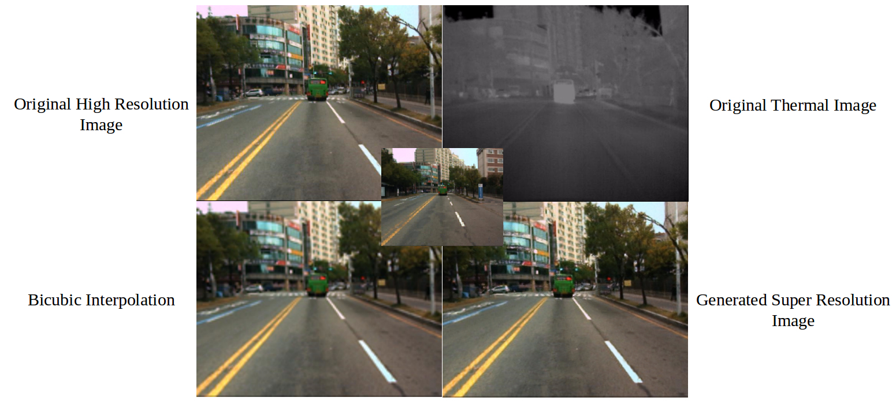
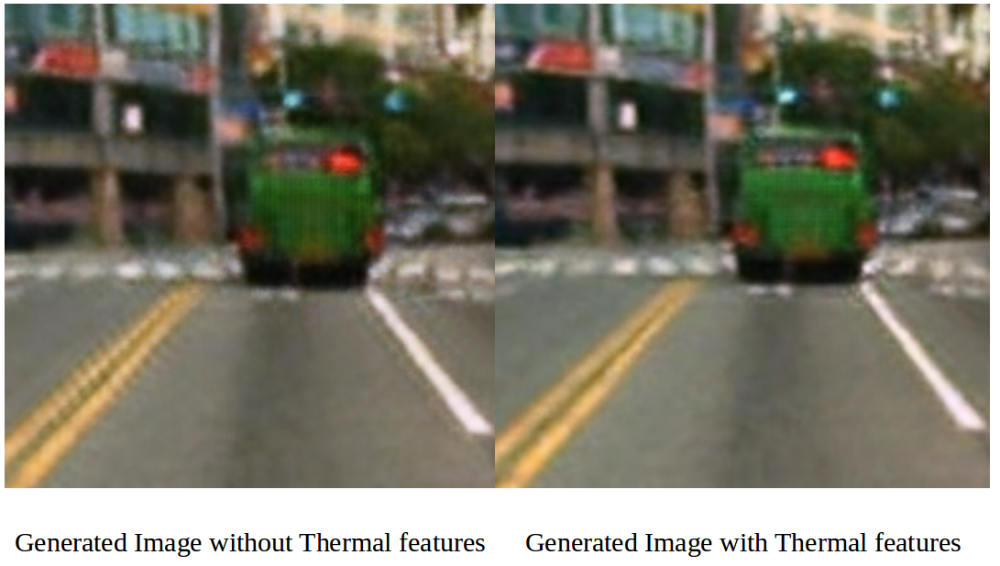

# Pixelx4
Pixel x4 is a image super-resolution deep learning algorithm. It uses both the deep convolutional GANs for generating realistic images and the distance based loss function for creating visually similar images.

The previous work proposes a super-resolution generative adversarial network (SRGAN [1]) which employs a deep residual network (ResNet) with skip-connection. In our proposed architecture, the neural network takes a low-resolution image (RGB and its Thermal Counterpart) and predicts the high-resolution image. The idea behind using thermal image is for better feature extraction which can be then used to reconstruct the image better. Thermal images are unaffected by luminous sources and hence will provide good edge detection and hence can make the SR images sharper.


### Network Architecture

<div align="center">
	
</div>


### Results
<div align="center">
	
</div>

<div align="center">
	
</div>

### Dataset
KAIST dataset [2] consisting pixel-by-pixel RGB and thermal LR image pair are given as input to the modal to produce the HR image. To get visually different images for better training, one out of every 40 images were picked and used for training and testing.

### Run  
- Prerequisites  
Please check the reference [1] for obtaining the VGG19 pretrained network weights and for setting up the tensor layer.

- Configuration  
Modify the image_path in the `config.py` file as follows:
```python
config.TRAIN.img_path = "image_folder_path/"
```

- Training

```bash
python main.py
```

- Evaluation

```bash
python main.py --mode=evaluate 
```

### Contributors
* Venkat Raman  
* Vishal Hosakere  
* Gokul Prasath Nallasami (me)  


### Reference
* [1] https://github.com/tensorlayer/srgan
* [2] https://soonminhwang.github.io/rgbt-ped-detection/data/


### License

- For academic and non-commercial use only.
